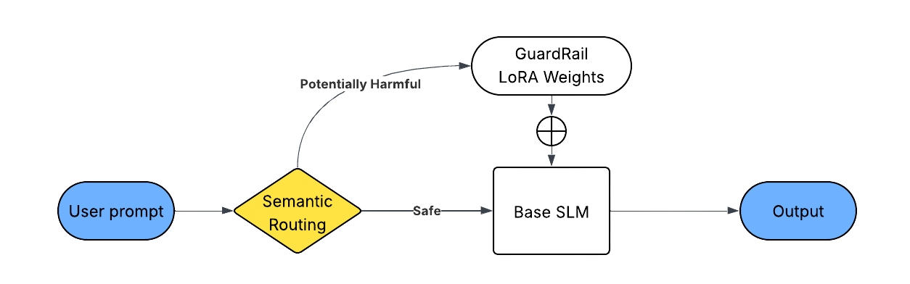

# SafeSLM

**SafeSLM** is a Python library designed to make **small language models (SLMs)** safer for deployment by fine-tuning them on safety datasets using LoRA adapters. It provides an easy-to-use class-based API and CLI for training, loading, and inference while keeping safety-related logic separate from reasoning or other tasks.

---

## 🚀 Motivation

Small language models, because they contain far fewer parameters, tend to memorize less context. This makes them more **vulnerable to simple prompt-based jailbreaks**. Large language models, on the other hand, have more weights and capacity, which allows them to:

* Detect malicious prompt manipulations
* Resist unsafe instructions
* Maintain high accuracy on legitimate tasks

However, SLMs perform best when focused on a **single task**. Forcing an SLM to perform multiple tasks—such as safety enforcement and reasoning—can degrade its performance.

**SafeSLM’s approach**:

* Keep tasks separate by training small models specifically for **safety detection**.
* For a given task, the model considers **all related prompts safe** and others unsafe.
* LoRA adapters allow fine-tuning safety behavior **without modifying the base model**, preserving the performance of model

---

## ✨ Key Features

* 🔐Fine-tune small language models (GPT, LLaMA, Qwen, Gemma, etc.) on safety datasets using **LoRA adapters**
* 🧠 **Task-aware inference** with safety control per domain (`default`, `coding`, `content_creation`, `education`, etc.)
* 🧩 **Multiple Adapter Support:** Easily switch between different safety adapters on the same base model
* ⚙️ Supports **custom HuggingFace datasets** for domain-specific safety fine-tuning
* 🪶 Flexible precision modes — `full`, `8bit`, or `4bit` for efficient deployment
* 🧰 Simple, unified **Python API** and **CLI** for training and inference
* 🔄 Seamless integration with **semantic-router** for prompt routing and embedding-based safety checks

---

## 🧩 Installation

```bash
# Install routing dependency
pip install -qU "semantic-router[fastembed]==0.1.0"

# Install SafeSLM
pip install safeslm
```

> **Note:** Restart your environment (if on Colab) after installation.

---

## 🧠 Usage


### Python API

```python
from safeslm import SafeSLM

# Train a new LoRA adapter on safety data
model = SafeSLM("gpt2", precision="full", device="cuda")
model.train(
    output_dir="./adapter_out",
    dataset_name="your_dataset_name_here",  # optional, defaults to Anthropic/hh-rlhf
    num_train_epochs=5,
    per_device_train_batch_size=4
)

# Load the adapter for inference
safe_model = SafeSLM(
    "gpt2",
    precision="full",
    device="cuda",
    adapter_path="./adapter_out/lora_adapter"
)

# Run prompts with a task (currently supports:"default","coding","content_creation","education",)
output = safe_model("Is it safe to share my password online?", task="default")
print(output)
```

### CLI

```bash
# Train LoRA adapter
safeslm train --model gpt2 --out_dir ./adapter_out --dataset your_dataset_name_here --epochs 5 --batch_size 4 --precision full --device cuda

# Run inference
safeslm infer --model gpt2 --adapter ./adapter_out/lora_adapter --prompt "What are safe browsing practices?" --task default --precision full --device cuda
```

---

## 🔄 Multi-Adapter Workflow

You can train multiple LoRA adapters on different safety datasets or domains and switch between them without reloading the base model:

```python
# Load adapter A
adapter_a = SafeSLM("gpt2", adapter_path="./adapters/safety_v1/lora_adapter")

# Load adapter B
adapter_b = SafeSLM("gpt2", adapter_path="./adapters/safety_v2/lora_adapter")

# Run inference on both
print(adapter_a("Some potentially unsafe prompt", task="coding"))
print(adapter_b("Some potentially unsafe prompt", task="coding"))
```

---

## 🧬 Pipeline Overview

The SafeSLM pipeline consists of:

1. **Base Model Loader:** Loads supported models (GPT, LLaMA, Qwen, Gemma, etc.) in the chosen precision.
2. **LoRA Adapter Injector:** Injects fine-tuned adapters for safety control without altering core weights.
3. **Semantic Router & Encoder:** Routes prompts and encodes embeddings for safety classification.
4. **Pipeline Execution** – Handles prompt routing, LoRA injection, and generation.

<div style="background-color: white; display: inline-block;">
  
</div>

---


---
## 💡 Why SafeSLM?

| Problem                                 | SafeSLM Solution                                           |
| --------------------------------------- | ---------------------------------------------------------- |
| SLMs are easy to jailbreak              | Fine-tunes on safety data for domain-specific resistance   |
| Adding safety degrades reasoning        | Separates tasks via adapters to maintain core capabilities |
| Hard to manage multiple safety profiles | Load multiple LoRA adapters dynamically                    |
| Limited compute for training            | Supports low-bit quantization for fast, efficient runs     |
| Custom datasets needed                  | Directly supports any HuggingFace dataset                  |

---

## 🧑‍💻 Contributing

Contributions are welcome! Please submit issues or pull requests.
For major changes, open a discussion first.

---

## 📜 License

This project is licensed under the [MIT License](LICENSE).

---

> **SafeSLM** — Bringing **modular safety** to small language models without compromising performance.
